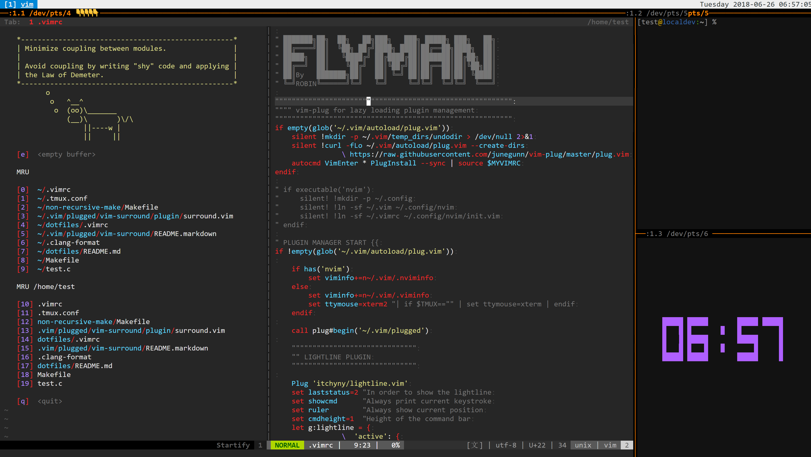

# dotfiles
A set of terminal configuration files for zsh, tmux, vim (fast, simple, minimal, off the shelf).  
All options and UI are carefully crafted, no boilerplate, no gaint dependency!.
All files work flawlessly on development and production server.

## How to use these files
- put them under your home folder. E.g. `~/.vimrc`

## Principle
- never remove or replace the default keybinding, only enhancements.
- applies your knowledge to different terminals, linux distrubutions, and OS
- productive and professional 
- minimal redundant information on USER Interface! It is clean while infomative!

## VIM
- Features List
  - **single-hand** operation is never been easier
  - auto-save file, no need to press :w to save file anymore
  - unlimited undo history, fearless edititng
  - **50ms** startup time, every ms counts! always fast!
  - configuration file auto-reload on modified inside vim
  - carefully selected high quality plugins that is absolutely improve productivity
  - crafted UX that is modern and prove its quality in details
  - search visual selection with * or # key
  - straightforward buffer list management
  - user-firendly and efficient undotree panel
  - **works without any plugins** if thats your style

## TMUX
- Best TMUX Configuration as far as I know 
  - User Experience Oriented, especially for users that are new to CLI
  - Native COPY/PASTE experience across terminal/OS. Never been easier than this!
  - crafted UX that is modern and prove its quality in details

## Dependency && Install
Most up to date desktop linux does not need install anything and it will work with full features.
For server users, here is a list of troubleshoots and environement configurations.
- if the color does not looks right, do the following 
    - `yum install xterm` or `apt install xterm`
    - `export TERM=xterm`
    - `export TERMINFO=/usr/share/terminfo`
    - put above exports into your bashrc or zshrc
    - `source ~/.bashrc`
    - if above tips do not help, change your terminal emulator to Alacritty/ST/iTerm2/Chrome Secure Shell Extension

## Sreencast, configurations, key-mapping explained
- #### TMUX
  - prefix is `` ` `` (backtick under ~) or `Ctrl-b`
  - press prefix twice to send `` ` `` (backtick under ~) or `Ctrl-b`
  - Dettach && Attach to Mantain the Session
    - `<prefix> d`   ; dettach
    - `<prefix> D`   ; dettach other users 
    - `<prefix> w`   ; display info on sessions/windows/panes
    - `tmux attach`  ; attach to last access Session `tmux a` works too.
    - `tmux attach -t <session id>` ;attach to <session>
    - `tmux list-sessions` ; list sessions
  - COPY/PASTE
    - mouse
      - left click and drag to select, copy on stop
      - middle or right click to paste
      - while on copu, press <prefix> to stay in copy mode
    - keyboard
      - `<prefix> Enter` ; enter copy mode
      - `Enter` ; exit copy mode
      - vi-key binding to move cursor 
      - `v` ; start selection
      - `y` ; copy/yank the text
      - `<prefix> p` ; paste the text from buffer
    - Search Display Buffer
      - `<prefix> /` ; search upward
      - Under COPY MODE
        - `/` search forward
        - `?` search backward
  - Create Windows/Navigate
    - `<prefix> c   `; create new windows
    - `<prefix> 1-9 `; go to windows 1-9
    - `<prefix> n   `; go to next windows
    - `<prefix> -   `; create horizontal split
    - `<prefix> \   `; create vertical split
  - TMUX pane features
    - `<prefix> a`   ; go to last acessed window
    - `<prefix> z`   ; ZOOM the current pane to use all display space
    - `<prefix> s`   ; synchornize the input in all panels under the same window
    - `<prefix> x`   ; kill the current panel
    - `<prefix> ,`   ; rename the windows
    - `<prefix> T`   ; rename the pane
    - `<prefix> t`   ; show clock
  - TMUX command line
    - `<prefix> :`   ; enter command line
    - `<esc>`        ; editing cmdline with vi-key binding
    - `<prefix> ~`   ; show output log history
    - `<prefix> *`   ; use ctrl-b as only prefix key, useful for nested tmux sessions
- #### VIM
  - Vim itself is huge topic to cover, for built-in shortcuts and functionality,   
  please checkout my vim [cheatsheet](https://www.cheatography.com/piping/cheat-sheets/vim-ide/) and the book `practical vim`
  - The list belows is FAQ for frequent used shortcuts and provides common solutions
  - ##### How to naviagte different files
    - `:Explorer` command shows directory and files
    - `:ls` shows opened buffer and `:b<number>` switch to that buffer(file)
    - `<space>b` keymapping does above in one shot
    - `Ctrl-w s` horizontal split current window
    - `Ctrl-w v` vertical split current window
    - `splitright` and `splittop` set where the new splitted windows will be placed
    - `:tabnew` or `<space>t` will open new tab 
    - `gt` mapping swithes between tabs, `3gt` goes to tab number 3
    - `gf` open the file under cursor or open FZF fuzzy file search
    - `Ctrl-i` and `Ctrl-o` jumps between next/old cursor position, can switch to different files too. 
